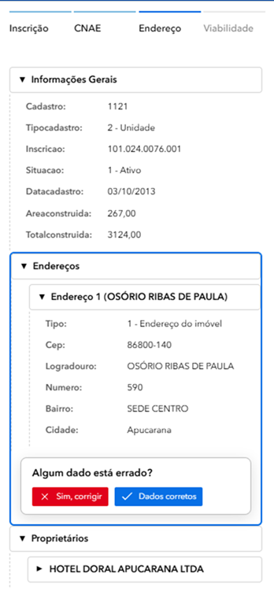
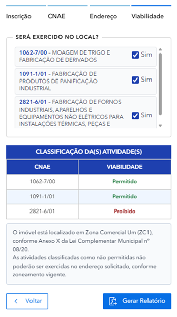

  

# 📘 Tutorial: Consulta de Viabilidade Econômica  

**Município de Apucarana - Guia Prático de Uso**  

---  

## 📑 Índice  

1. [Introdução](#introdução)  
2. [A Interface](#a-interface)  
3. [Legendas e Cores](#legendas-e-cores)  
4. [Zoneamento](#zoneamento)  
5. [Como Buscar](#como-buscar)  
6. [Classificação de Atividades](#classificação-de-atividades)  
7. [Relatório de Viabilidade](#relatório-de-viabilidade)  
8. [Casos Práticos](#casos-práticos)  
9. [FAQ](#faq)  

---  

## 🎯 Introdução 

Bem-vindo ao tutorial da aplicação **Consulta de Viabilidade Econômica**! Esta ferramenta foi desenvolvida para ajudar você a consultar informações sobre lotes e avaliar a viabilidade econômica de empreendimentos no município de Apucarana.  

### O que você vai aprender:  

- Como acessar e navegar na aplicação  
- Entender o mapa interativo e suas legendas  
- Conhecer os diferentes zoneamentos  
- Realizar buscas por inscrição cadastral  
- Interpretar as informações de viabilidade e relatórios gerados  

> 💡 **Dica:** Este tutorial leva aproximadamente 20 minutos para ser concluído. Você pode navegar pelas seções clicando no índice acima.  

---  

## 🖥️ A Interface 

### 1️⃣ O Mapa Interativo Central  

A parte central da tela mostra um mapa do município de Apucarana com a localização dos lotes, zoneamentos e áreas de interesse.  

  

*Mapa interativo do município de Apucarana*  

> 💡 Você pode ampliar (zoom) e mover o mapa usando o mouse. Use a rodinha do mouse para zoom!  

### 2️⃣ O Painel Lateral Direito  

À direita, você encontra as abas de consulta com as seguintes opções:  

- **Inscrição:** Busca por inscrição cadastral do lote  
- **CNAE:** Atividades econômicas permitidas  
- **Endereço:** Busca por localização  
- **Viabilidade:** Análise de viabilidade econômica  

  

*Painel lateral direito com abas de consulta*  

### 3️⃣ Controles do Mapa  

À esquerda do mapa, você encontra os botões de controle:  

- **+/-** Zoom in e zoom out  
- **🏠** Voltar para a visão inicial  
- **⬅️➡️** Navegar entre visualizações anteriores  
- **⬆️** Bússola / orientação do mapa  
- **ℹ️** Exibe detalhes sobre os atributos de uma camada  
- **🗑️** Limpar seleção  

### 4️⃣ Barra Superior  

Na parte superior da tela você encontra:  

- **Logo GeoAPUC** e título da aplicação  
- **Barra de busca** central: "Encontrar endereço ou lugar"  
- **Ícones** no canto direito: camadas, lista, grid, régua, impressora e gráfico  

  

*Barra superior da aplicação*  

---  

## 🎨 Legendas e Cores 

Entenda cada elemento do mapa e o que suas cores representam:  

### 📍 Mapa Cadastral  

| Símbolo | Cor | Significado |  
|---------|-----|-------------|  
| 🟨 | Amarelo (#FFFF99) | Lotes - Lotes e propriedades urbanas |  

### 🏛️ Dados da Prefeitura  

| Símbolo | Cor | Significado |  
|---------|-----|-------------|  
| 📍 | Azul (#87CEEB) | Lagos - Corpos de água e reservatórios |  
| ❌ | Vermelho (tracejado) | Perímetro Urbano e Distrital |  

  

*Legenda completa do mapa*  

---  

## 📊 Zoneamento - Tipos de Uso 

O zoneamento define o tipo de atividade permitida em cada área.  

### 🏘️ Zoneamento Residencial (ZR)  

| Zona | Descrição |  
|------|-----------|  
| **ZR1** | I - Zona Residencial Um – zona predominantemente residencial |  
| **ZR2** | II - Zona Residencial Dois – zona predominantemente residencial |  
| **ZR3** | III - Zona Residencial Três – zona predominantemente residencial, com maior permissividade de atividades de comércio e serviços |  
| **ZR4** | IV - Zona Residencial Quatro – zona residencial onde se localizam os núcleos e conjuntos habitacionais |  
| **ZR5** | V - Zona Residencial Cinco – zona predominantemente residencial |  
| **ZR28** | VI - Zona Residencial do Vinte e Oito – zona predominantemente residencial que compreende os lotes pertencentes à região denominada 28 de janeiro |  
| **ZRCH** | VII - Zona Residencial de Chácaras – zona predominantemente residencial |  
| **ZOC** | VIII - Zona de Ocupação Controlada – área de interesse para fins do abastecimento hídrico, respeitando os critérios aplicáveis |  

### 🛍️ Zonas ou Eixos de Comércio e Serviços (ZC)  

| Zona | Descrição |  
|------|-----------|  
| **ZC1** | I - Zona Comercial Um – zona central predominantemente com usos comerciais e serviços centrais e com número livre de pavimentos nos edifícios |  
| **ZC2** | II - Zona Comercial Dois – zona central predominantemente com usos comerciais e serviços centrais; na sede, encontra-se predominantemente na zona de transição entre o centro e os bairros a sul; nos distritos de Pirapó e Vila Reis está presente na área central |  
| **ZC3** | III - Zona Comercial Três – zona central com usos comerciais e serviços centrais; na sede localizada na região da Barra Funda e Avenida Minas Gerais; nos distritos atua como zona de transição entre zonas industriais e residenciais |  
| **ZC4** | IV - Zona Comercial Quatro – zona de comércio e serviços de escala local, com edifícios e até 3 (três) pavimentos |  
| **ZC5** | V - Zona Comercial Cinco – zona de comércio e serviços, localizada no entorno do Lago Jaboti |  
| **ZC28** | VI - Zona Comercial do Vinte e Oito – zona predominantemente de comércio e serviços que compreende os lotes pertencentes à região denominada 28 de janeiro |  

### 🏭 Zonas Industriais (ZI)  

| Zona | Descrição |  
|------|-----------|  
| **ZI1** | I - Zona Industrial 1 – destinadas às atividades industriais incômodas, não nocivas ou perigosas, de baixo impacto ambiental |  
| **ZI2** | II - Zona Industrial 2 – destinadas às atividades industriais incômodas ou nocivas, de maior porte e maior impacto ambiental |  

### ✳️ Zonas de Caráter Especial (ZE e correlatas)  

| Zona | Descrição |  
|------|-----------|  
| **ZE** | I - Zona Especial: área de domínio público municipal/estadual/federal com critérios de ocupação do solo e atividades específicas, a serem definidas pelo órgão municipal responsável |  
| **ZEPC** | II - Zona Especial de Praças e Canteiros – praças e canteiros municipais não edificáveis |  
| **ZEA** | III - Zona Especial de Adensamento – zonas próximas aos campi universitários, visando suprir demanda por habitação e atividades complementares |  
| **ZEIS** | IV - Zona Especial de Interesse Social – áreas destinadas a programas sociais e regularização fundiária para habitações de interesse social |  
| **ZEVR** | V - Zona Especial de Vilas Rurais – loteamentos residenciais implantados via Programa "Vila Rural" |  
| **ZP** | VI - Zona de Preservação Ambiental – espaço territorial regido pela legislação ambiental, incluindo parques, reservas, APPs e áreas de proteção ambiental |  

  

*Mapa com todos os zoneamentos*  

> ⚠️ Cada zoneamento tem restrições específicas. Consulte a prefeitura para detalhes sobre o que é permitido em cada zona.  

---  

## 🔍 Como Buscar um Lote 

### 1️⃣ Use a Barra de Busca Superior  

Na parte superior, há uma barra de busca onde você pode digitar endereço ou lugar.  

  

*Barra de busca superior*  

### 2️⃣ Busque por Inscrição Cadastral  

No painel lateral direito, clique na aba **"Inscrição"** e digite o número no campo indicado.  

O formato da inscrição é:  
**Exemplo:** `109.011.0204.001` ou `103.068.0123.001`  

> 💡 Se não souber a inscrição, use a aba **"Endereço"** para buscar pela rua ou bairro.  

### 3️⃣ Clique em "Próximo"  

Após digitar a inscrição 101.024.0076.001 o imóvel foi encontrado na Rua Osório Ribas de Paula, 590 – sede centro, clique no botão **"Próximo >"** para avançar.  

### 4️⃣ Visualize o Resultado  

O mapa irá centralizar no lote encontrado e exibirá as informações no painel direito.  

  

*Resultado da busca no mapa*  

### 5️⃣ Informações da Inscrição  

Após clicar em "Próximo", você verá a classificação da atividade e sua viabilidade. Vamos escolher um tipo de serviço que pretende-se investigar a viabilidade de implantação de acordo com o zoneamento da cidade.

Exemplo: Subclasse - padaria

Para esse exemplo, vamos escolher mais de uma opção porque pretende-se exercer várias atividades dentro do mesmo ramo "padaria".

---  

## 🎯 Classificação de Atividades 

  

*Classificação das atividades*  

### 6️⃣ Validação do Endereço

É necessário realizar um check-in para validação do endereço. Caso as informações estejam corretas, clique em "Dados corretos".

  

*Validação do Endereço*

Neste momento, o sistema realiza uma análise espacial para verificar a permissibilidade da atividade no local informado, considerando os parâmetros urbanísticos vigentes e as disposições estabelecidas pelo Plano Diretor Municipal.

Como foram selecionados três CNAEs para o estabelecimento, o sistema processa as informações e apresenta ao usuário o resultado da análise, indicando a situação de cada atividade em relação à permissibilidade de uso e ocupação do solo.

### 7️⃣ Análise Espacial

*Resultado da análise de permissibilidade de uso*

De acordo com a análise realizada com base no zoneamento municipal vigente, é permitido o exercício das seguintes atividades no endereço informado:

a) 1062-7/00 – Moagem de trigo e fabricação de derivados  
b) 1091-1/01 – Fabricação de produtos de panificação industrial  

Entretanto, para a atividade:

c) 2821-6/01 – Fabricação de fornos industriais, aparelhos e equipamentos não elétricos para instalações térmicas, peças e acessórios

o resultado da análise indica que **não é permitido** o seu exercício no local informado.

> ⚠️ **Aviso:** O imóvel está situado em Zona Comercial Um (ZC1), conforme disposto no Anexo X da Lei Complementar Municipal nº 08/20. Em razão das restrições estabelecidas pelo zoneamento vigente, as atividades classificadas como não permitidas não poderão ser desenvolvidas no endereço solicitado. Dessa forma, o CNAE 2821-6/01 somente poderá constar no cadastro caso a respectiva atividade não seja efetivamente exercida neste local.

Clique em **"Gerar Relatório"**.

---

## 📄 Relatório de Viabilidade 

Após completar a consulta, um relatório de viabilidade será gerado.  

  

*Relatório de viabilidade gerado com sucesso!*  

---  

## 💼 Casos Práticos 

### Caso 1: Encontrar Lote para Comércio  

**Objetivo:** Buscar lotes em zona comercial ou especializada.  

**Passos:**  
1. Na legenda, identifique as zonas comerciais: **ZEC28, ZEOC e ZPC**  
2. O mapa mostrará as áreas correspondentes nas cores indicadas  
3. Use a barra de busca para encontrar endereços nessas zonas  
4. Clique no lote para ver a inscrição e viabilidade  

---  

### Caso 2: Verificar Zoneamento de um Endereço  

**Objetivo:** Saber qual é o zoneamento de um lote específico.  

**Passos:**  
1. Busque o endereço na barra de busca superior  
2. O mapa vai centralizar no local  
3. Verifique a cor da área no mapa  
4. Consulte a tabela de zoneamento para entender as regras  

---  

### Caso 3: Identificar Propriedade pelo Cadastro  

**Objetivo:** Localizar um lote usando sua inscrição cadastral.  

**Passos:**  
1. No painel direito, clique na aba **"Inscrição"**  
2. Digite a inscrição: `109.011.0204.001`  
3. Clique em **"Próximo >"**  
4. O mapa vai centralizar no lote e exibir todos os dados  

---  

## ❓ FAQ - Perguntas Frequentes 

**Como saber a viabilidade econômica de um lote?**  
Após buscar o lote, clique na aba **"Viabilidade"** no painel direito. Lá você encontrará informações sobre a viabilidade econômica do empreendimento.  

**O que é CNAE?**  
CNAE (Classificação Nacional de Atividades Econômicas) indica que tipo de atividades econômicas são permitidas naquele lote. Exemplo: comércio, serviços, indústria.  

**Os dados são atualizados?**  
Sim, os dados são atualizados conforme novas informações são registradas na prefeitura.  

**Posso usar esse mapa como prova legal?**  
Este mapa é informativo. Para questões legais e documentos oficiais, procure a **Idepplan** - Instituto de Desenvolvimento, Pesquisa e Planejamento de Apucarana.  

**A aplicação funciona em celular?**  
Sim! A aplicação é responsiva e funciona bem em smartphones e tablets. Acesse pelo navegador do seu dispositivo.  

**Encontrei um erro nos dados. Como reportar?**  
Entre em contato com a Idepplan - Prefeitura de Apucarana através do email: **idepplan@apucarana.pv.gov.br**  

---  

## 📞 Contato  

**Tutorial - Consulta de Viabilidade Econômica | Apucarana - PR**  

📧 Email: [idepplan@apucarana.pv.gov.br](mailto:idepplan@apucarana.pv.gov.br)  
📱 Tel: (43) 3422-4000  

---  

*Última atualização: 2026 | Município de Apucarana - PR*