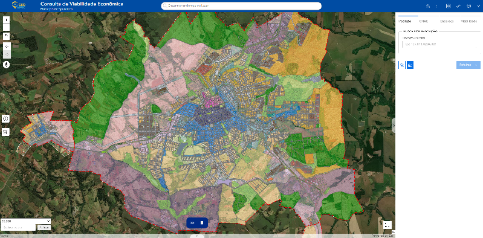
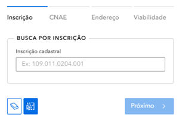
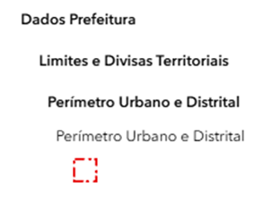
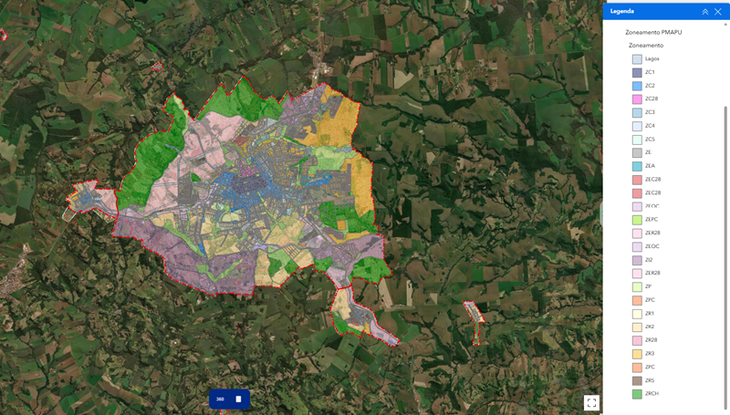
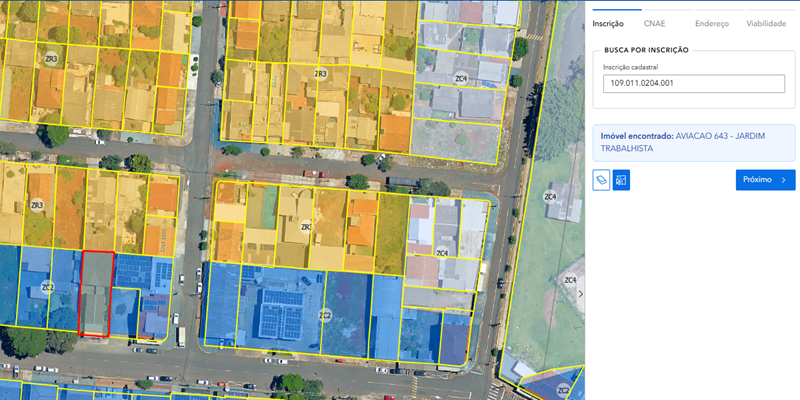
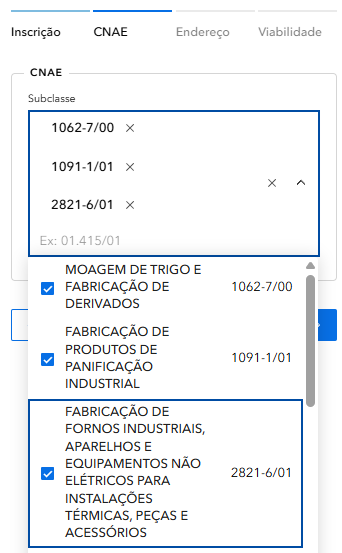
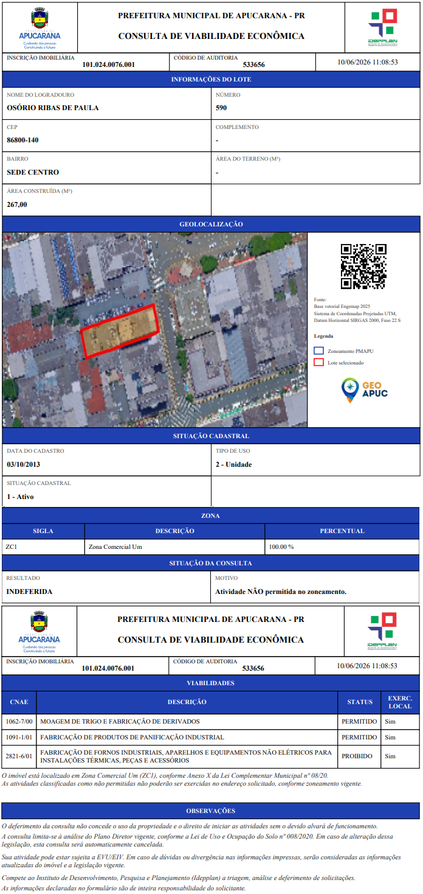

# 📘 Tutorial: Consulta de Viabilidade Econômica  

**Município de Apucarana - Guia Prático de Uso**  

---  

## 📑 Índice  1️⃣ O Mapa Interativo Central

1. [Introdução](#introdução)  
2. [A Interface](#a-interface)  
3. [Legendas e Cores](#legendas-e-cores)  
4. [Zoneamento](#zoneamento)  
5. [Como Buscar](#como-buscar)  
6. [Casos Práticos](#casos-práticos)  
7. [FAQ](#faq)  
8. [Classificação de Atividades](#classificacao-de-atividades)  
9. [Relatório de Viabilidade](#relatorio-de-viabilidade)  

---  

<a name="introdução">## 🎯 Introdução</a>  

Bem-vindo ao tutorial da aplicação **Consulta de Viabilidade Econômica**! Esta ferramenta foi desenvolvida para ajudar você a consultar informações sobre terrenos e avaliar a viabilidade econômica de empreendimentos no município de Apucarana.  

### O que você vai aprender:  

- Como acessar e navegar na aplicação  
- Entender o mapa interativo e suas legendas  
- Conhecer os diferentes zoneamentos  
- Realizar buscas por inscrição cadastral  
- Interpretar as informações de viabilidade e relatórios gerados  

> 💡 **Dica:** Este tutorial leva aproximadamente 20 minutos para ser concluído. Você pode navegar pelas seções clicando no índice acima.  

---  

<a name="a-intereface">## 🖥️ A Interface</a>  

### 1️⃣ O Mapa Interativo Central  

A parte central da tela mostra um mapa do município de Apucarana com a localização dos terrenos, zoneamentos e áreas de interesse.  

  

*Mapa interativo do município de Apucarana*  

> 💡 Você pode ampliar (zoom) e mover o mapa usando o mouse. Use a rodinha do mouse para zoom!  

<a name="a-interface">### 2️⃣ O Painel Lateral Direito</a>  

À direita, você encontra as abas de consulta com as seguintes opções:  

- **Inscrição:** Busca por inscrição cadastral do terreno  
- **CNAE:** Atividades econômicas permitidas  
- **Endereço:** Busca por localização  
- **Viabilidade:** Análise de viabilidade econômica  

  

*Painel lateral direito com abas de consulta*  

### 3️⃣ Controles do Mapa  

À esquerda do mapa, você encontra os botões de controle:  

- **+/-** Zoom in e zoom out  
- **🏠** Voltar para a visão inicial  
- **⬅️➡️** Navegar entre visualizações anteriores  
- **⬆️** Bússola / orientação do mapa  
- **ℹ️** Informações  
- **🗑️** Limpar seleção  

### 4️⃣ Barra Superior  

Na parte superior da tela você encontra:  

- **Logo GeoAPUC** e título da aplicação  
- **Barra de busca** central: "Encontrar endereço ou lugar"  
- **Ícones** no canto direito: camadas, lista, grid, régua, impressora e gráfico  

  

*Barra superior da aplicação*  

---  

<a name="legendas-e-cores">## 🎨 Legendas e Cores</a>  

Entenda cada elemento do mapa e o que suas cores representam:  

### 📍 Mapa Cadastral  

| Símbolo | Cor | Significado |  
|---------|-----|-------------|  
| 🟨 | Amarelo (#FFFF99) | Lotes - Terrenos e propriedades urbanas |  

### 🏛️ Dados da Prefeitura  

| Símbolo | Cor | Significado |  
|---------|-----|-------------|  
| 📍 | Azul (#87CEEB) | Lagos - Corpos de água e reservatórios |  
| ❌ | Vermelho (tracejado) | Perímetro Urbano e Distrital |  

  

*Legenda completa do mapa*  

---  

<a name="zoneamento">## 📊 Zoneamento - Tipos de Uso</a>  

O zoneamento define o tipo de atividade permitida em cada área.  

### 🏘️ Zoneamento Residencial (ZR)  

| Zona | Cor | Descrição |  
|------|-----|-----------|  
| **ZR1** | #FFFFCC (Amarelo Claro) | Zona Residencial 1 |  
| **ZR2** | #FFE0B2 (Bege) | Zona Residencial 2 |  
| **ZR3** | #FFCC99 (Laranja Claro) | Zona Residencial 3 |  
| **ZR5** | #999999 (Cinza) | Zona Residencial 5 |  

### 💼 Zoneamento Especializado (ZE)  

| Zona | Cor | Descrição |  
|------|-----|-----------|  
| **ZEA** | #ADD8E6 (Azul Claro) | Zona Especializada Administrativa |  
| **ZEC28** | #FFAACC (Rosa) | Zona Especializada Comercial |  
| **ZER28** | #FFAACC (Rosa) | Zona Especializada Residencial |  
| **ZEOC** | #E6CCFF (Roxo Claro) | Zona Especializada de Comércio |  
| **ZEPC** | #CCFFCC (Verde Claro) | Zona Especializada de Produção |  

### 🌳 Outros Zoneamentos  

| Zona | Cor | Descrição |  
|------|-----|-----------|  
| **ZPC** | #FFAA99 (Salmão) | Zona de Proteção da Comunidade |  
| **ZRCH** | #90EE90 (Verde) | Zona de Patrimônio Histórico |  
| **ZP** | #FFDDAA (Amarelo Forte) | Zona de Proteção |  
| **ZI2** | #CCCCCC (Cinza Claro) | Zona Industrial |  

  

*Mapa com todos os zoneamentos*  

> ⚠️ Cada zoneamento tem restrições específicas. Consulte a prefeitura para detalhes sobre o que é permitido em cada zona.  

---  

<a name="como-buscar">## 🔍 Como Buscar um Terreno</a>  

### 1️⃣ Use a Barra de Busca Superior  

Na parte superior, há uma barra de busca onde você pode digitar endereço ou lugar.  

  

*Barra de busca superior*  

### 2️⃣ Busque por Inscrição Cadastral  

No painel lateral direito, clique na aba **"Inscrição"** e digite o número no campo indicado.  

O formato da inscrição é:  
**Exemplo:** `109.011.0204.001` ou `103.068.0123.001`  

> 💡 Se não souber a inscrição, use a aba **"Endereço"** para buscar pela rua ou bairro.  

### 3️⃣ Clique em "Próximo"  

Após digitar a inscrição, clique no botão **"Próximo >"** para avançar.  

### 4️⃣ Visualize o Resultado  

O mapa irá centralizar no lote encontrado e exibirá as informações no painel direito.  

  

*Resultado da busca no mapa*  

### 5️⃣ Informações da Inscrição  

Após clicar em "Próximo", você verá a classificação da atividade e sua viabilidade.  

  

*Classificação das atividades*  

### 6️⃣ Relatório Gerado  

Após completar a consulta, um relatório de viabilidade será gerado.  

  

*Relatório de viabilidade gerado com sucesso!*  

---  

<a name="casos-práticos">## 💼 Casos Práticos</a>  

### Caso 1: Encontrar Terreno para Comércio  

**Objetivo:** Buscar lotes em zona comercial ou especializada.  

**Passos:**  
1. Na legenda, identifique as zonas comerciais: **ZEC28, ZEOC e ZPC**  
2. O mapa mostrará as áreas correspondentes nas cores indicadas  
3. Use a barra de busca para encontrar endereços nessas zonas  
4. Clique no lote para ver a inscrição e viabilidade  

---  

### Caso 2: Verificar Zoneamento de um Endereço  

**Objetivo:** Saber qual é o zoneamento de um terreno específico.  

**Passos:**  
1. Busque o endereço na barra de busca superior  
2. O mapa vai centralizar no local  
3. Verifique a cor da área no mapa  
4. Consulte a tabela de zoneamento para entender as regras  

---  

### Caso 3: Identificar Propriedade pelo Cadastro  

**Objetivo:** Localizar um terreno usando sua inscrição cadastral.  

**Passos:**  
1. No painel direito, clique na aba **"Inscrição"**  
2. Digite a inscrição: `109.011.0204.001`  
3. Clique em **"Próximo >"**  
4. O mapa vai centralizar no lote e exibir todos os dados  

---  

<a name="faq">## ❓ FAQ - Perguntas Frequentes</a>  

**Como saber a viabilidade econômica de um terreno?**  
Após buscar o terreno, clique na aba **"Viabilidade"** no painel direito. Lá você encontrará informações sobre a viabilidade econômica do empreendimento.  

**O que é CNAE?**  
CNAE (Classificação Nacional de Atividades Econômicas) indica que tipo de atividades econômicas são permitidas naquele terreno. Exemplo: comércio, serviços, indústria.  

**Os dados são atualizados?**  
Sim, os dados são atualizados conforme novas informações são registradas na prefeitura.  

**Posso usar esse mapa como prova legal?**  
Este mapa é informativo. Para questões legais e documentos oficiais, procure a **Idepplan** - Instituto de Desenvolvimento, Pesquisa e Planejamento de Apucarana.  

**A aplicação funciona em celular?**  
Sim! A aplicação é responsiva e funciona bem em smartphones e tablets. Acesse pelo navegador do seu dispositivo.  

**Encontrei um erro nos dados. Como reportar?**  
Entre em contato com a Idepplan - Prefeitura de Apucarana através do email: **sic@apucarana.pr.gov.br**  

---  

## 📞 Contato  

**Tutorial - Consulta de Viabilidade Econômica | Apucarana - PR**  

📧 Email: [suporte@apucarana.gov.br](mailto:suporte@apucarana.gov.br)  
📱 Tel: (43) 3422-4000  

---  

*Última atualização: 2026 | Município de Apucarana - PR*